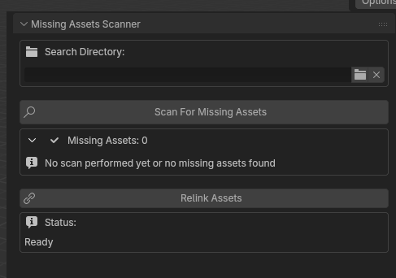

#  Blender Missing Assets Relinker 🕵️‍♂️

A powerful and intuitive Blender addon to scan, locate, and relink missing external files in your projects. Say goodbye to tedious manual searches for textures, libraries, and caches!

---

## ✨ Features

-   **Comprehensive Scanning:** Detects a wide range of missing assets:
    -   🖼️ Images & Textures
    -   📚 Linked Libraries
    -   🔊 Sound Files
    -   💨 Mesh Cache (including Alembic `.abc`)
    -   🌊 Ocean Cache
-   **Intuitive UI:** A clean and user-friendly panel located in the 3D View's N-Panel for easy access.
-   **Recursive Search:** Automatically searches through subdirectories of your chosen folder to find missing files.
-   **Progress Tracking:** A real-time progress bar and status updates show you exactly what the addon is doing during the relinking process.
-   **One-Click Relinking:** Relink all found assets with a single button press.
-   **Stop & Go:** You can stop the search process at any time.

---

## ⚙️ Installation

1.  **Download:** Get the latest version by downloading the `blender-texture-relinker_014.py` file from this repository.
2.  **Open Blender:** Launch Blender (version 4.5 or newer is recommended).
3.  **Install Add-on:**
    -   Go to `Edit > Preferences`.
    -   Navigate to the `Add-ons` section.
    -   Click the `Install...` button at the top-right.
    -   Find and select the `blender-texture-relinker_014.py` file you downloaded.
4.  **Enable Add-on:**
    -   After installing, search for "Missing Assets Scanner" in the add-on list.
    -   Check the box next to its name to enable it.

The "Missing Assets" tab will now be available in your 3D View's N-Panel.

---

## 🚀 How to Use

1.  **Open the Panel:** In the 3D Viewport, press the `N` key to toggle the side panel (N-Panel). Click on the **"Missing Assets"** tab.

2.  **Scan for Missing Files:**
    -   Click the **"Scan For Missing Assets"** button.
    -   The addon will check your entire `.blend` file.
    -   The number of missing assets will be displayed. You can expand the list to see details for each missing file.

     <!-- Placeholder for an image showing the scan results -->

3.  **Set the Search Directory:**
    -   Click the folder icon in the **"Search Directory"** field.
    -   Navigate to and select the main folder where you believe the missing files are located. The addon will search all subfolders within this directory.

4.  **Relink:**
    -   Click the **"Relink Assets"** button.
    -   The addon will begin searching for each missing file within the specified directory.
    -   A progress bar will show the status of the search.
    -   You can press the **"Stop"** button (which replaces the "Relink" button) to cancel the operation at any time.

     <!-- Placeholder for an image showing the relink in progress -->

5.  **Done!**
    -   Once finished, a status message will report how many files were successfully relinked.
    -   The addon will automatically re-scan to update the list of missing assets.

---

## 🤝 Contributing

Contributions, issues, and feature requests are welcome! Feel free to check the [issues page](https://github.com/your-username/your-repo/issues).

## 📝 License

This project is licensed under the MIT License - see the [LICENSE.md](LICENSE.md) file for details.

---

*This addon was generated with assistance from AI.*
